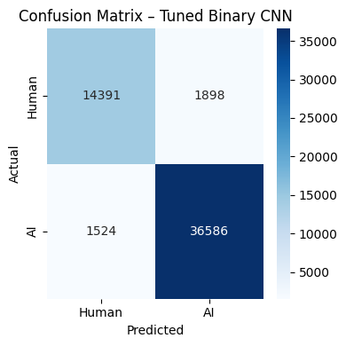
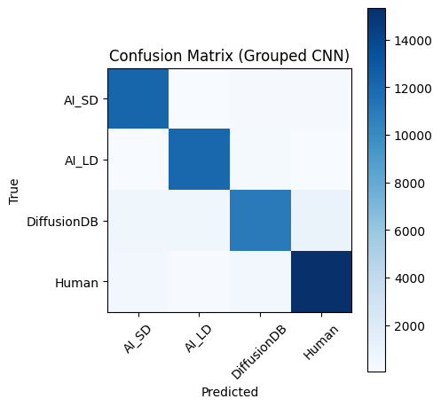
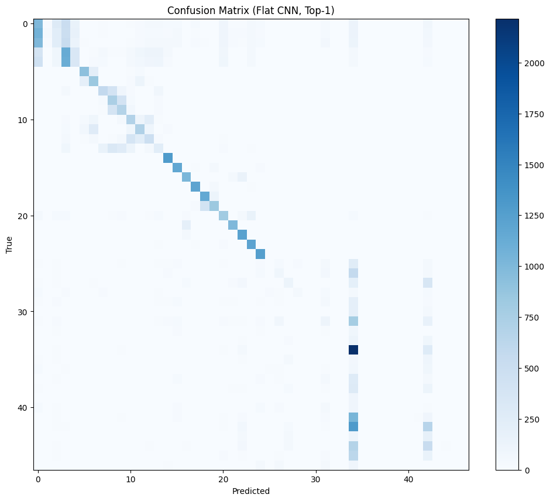
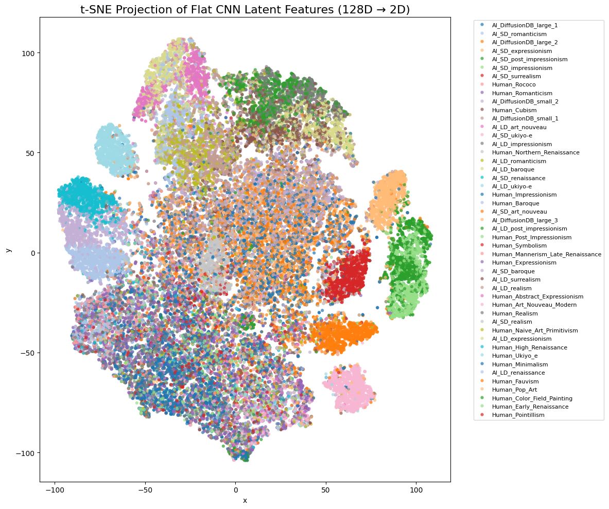
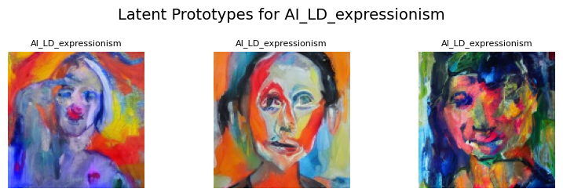

# 🧠🎨 AI vs. Human Art Classification

This project implements and analyzes a suite of deep learning models to classify whether an artwork was generated by AI or created by a human. The notebook explores binary classification, grouped multi-class classification, and fine-grained style classification (47 classes). We include interpretability via Grad-CAM, latent feature analysis (t-SNE, PCA), and prototype visualizations.

---

## 📁 Dataset

This project uses the [Kaggle Human AI Artwork Dataset](https://www.kaggle.com/datasets/adamelkholyy/human-ai-artwork-dataset), created by [Adam El Kholy](https://github.com/adamelkholyy). It contains **over 270,000 images** categorized into folders based on origin (AI or Human), style (e.g., Renaissance, Cubism), and generation engine (e.g., SD, LD, DiffusionDB).

> 🔍 **Citation (APA)**:  
> El Kholy, A. (2023). *Human AI Artwork Dataset*. Kaggle. https://www.kaggle.com/datasets/adamelkholyy/human-ai-artwork-dataset

---

## 🧪 Project Goals

- Determine whether a given image is AI-generated or human-made (binary classification).
- Classify artwork by AI engine (e.g., SD vs LD) and human sources (grouped multi-class).
- Attempt fine-grained style classification across 47 total categories (flat multi-class).
- Apply Grad-CAM to interpret model attention.
- Analyze latent feature space via t-SNE, PCA, and style prototypes.

---

## 🧠 Model Architectures

| Task                   | Model             | Top-1 Accuracy | Top-5 Accuracy | F1 Score (avg)   |
|------------------------|------------------|----------------|----------------|------------------|
| Binary (Human vs AI)   | Custom CNN (tuned) | **93.71%**     | 99.86% (binary) | **0.94**         |
| Grouped (4 Classes)    | Custom CNN         | **92.85%**     | **99.42%**      | **0.93**         |
| Flat (47 Classes)      | Custom CNN         | **44.38%**     | **84.22%**      | **0.39 (weighted)** |

**Tuned Hyperparameters**:
- 3 Convolutional layers: 32 → 64 → 64
- Batch Normalization + L2 regularization
- Dropout = 0.42
- Learning Rate = 0.005

---

## 🧾 Key Results

### ✅ Binary Classification

- Achieved **93.71% accuracy** on the test set of 54,000+ images.
- High F1 scores: **AI = 0.96**, **Human = 0.89**
- Confusion matrix shows strong distinction across both classes.

<p align="center">
  
</p>

---

### ✅ Grouped Multi-Class (4 Classes)

- Accurately separated AI_SD, AI_LD, DiffusionDB, and Human.
- Achieved **92.85% test accuracy**.
- F1 scores range from 0.88 (DiffusionDB) to 0.96 (AI_LD).

<p align="center">
  
</p>

---

### ✅ Flat Multi-Class (47 Styles)

- Reached **44.38% top-1 accuracy** and **84.22% top-5 accuracy**.
- Best AI styles: `AI_SD_ukiyo-e`, `AI_LD_art_nouveau`, `AI_SD_expressionism`.
- Worst human styles: `Human_Cubism`, `Human_Fauvism`, `Human_Symbolism`.

<p align="center">
  
</p>

---

## 🔍 Grad-CAM Insights

Grad-CAM visualizations reveal **style-specific activation** patterns:

| Model     | Focused Features                                      |
|-----------|--------------------------------------------------------|
| **Binary** | Texture, stroke regularity, composition               |
| **Grouped** | Source-specific traits (e.g., surrealism in LD)     |
| **Flat**   | Style-local cues (e.g., color patches in Fauvism, brushwork in Realism) |

<table>
  <tr>
    <td align="center"><strong>Binary</strong><br></td>
    <td align="center"><strong>Grouped</strong><br></td>
    <td align="center"><strong>Flat</strong><br></td>
  </tr>
</table>

---

## 🧬 Latent Feature Analysis

We project the model’s internal 128D representation using **t-SNE** and **PCA**:

- **AI styles form tight clusters** in latent space (low intra-class variance).
- **Human styles are more dispersed**, reflecting greater stylistic diversity.

<p align="center">
  
  <br/>
  <em>Figure: t-SNE projection of latent features (47 classes)</em>
</p>

### 🎯 Style Prototypes

We extract the 3 most representative images per class by finding latent centroids:

<p align="center">
  
</p>

---

## 📦 File Structure

```
.
├── finalnotebook.ipynb       # Your main Jupyter Notebook (core of the project)
├── requirements.txt          # All Python package dependencies listed here
├── .gitignore                # Tells Git what files/folders to ignore
├── README.md                 # Your full GitHub project description file
├── assets/                   # Folder for Grad-CAMs, confusion matrices, plots, etc.
└── data/                     # Local folder (NOT uploaded) that holds the Kaggle dataset
```

---

## 🛠️ Setup & Usage

Follow these steps to run the notebook locally:

```bash
# 1. Clone the repository
git clone https://github.com/rohit-ravi2/visual-classification-ai-vs-human-art.git
cd visual-classification-ai-vs-human-art

# 2. Create and activate a virtual environment
python3 -m venv .venv
source .venv/bin/activate

# 3. Install required dependencies
pip install -r requirements.txt

# 4. Download the dataset
# Visit: https://www.kaggle.com/datasets/adamelkholyy/human-ai-artwork-dataset
# Extract the files into ./data/
```

Once setup is complete, open `finalnotebook.ipynb` in Jupyter or VSCode and run all sections sequentially.

---

## 👥 Authors

- **Rohit Ravi** 
- **Ritsuka Ting** 
- **Brian Rabinowitz** 
---

## 📚 References

- El Kholy, A. (2023). *Human AI Artwork Dataset*. Kaggle. https://www.kaggle.com/datasets/adamelkholyy/human-ai-artwork-dataset  
- Selvaraju, R. R., Cogswell, M., Das, A., Vedantam, R., Parikh, D., & Batra, D. (2017). Grad-CAM: Visual Explanations from Deep Networks via Gradient-based Localization. *arXiv preprint* [arXiv:1610.02391](https://arxiv.org/abs/1610.02391)
